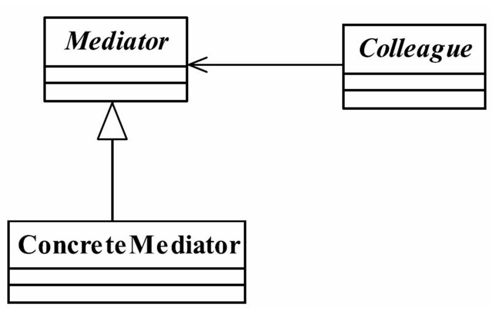

##中介者模式 Mediator Pattern
###一.定义为：
Define an object that encapsulates how a set of objects
interact.Mediator promotes loose coupling by keeping objects from referring to each other
explicitly,and it lets you vary their interaction independently.（用一个中介对象封装一系列的对象
交互，中介者使各对象不需要显示地相互作用，从而使其耦合松散，而且可以独立地改变它
们之间的交互。）
###二.通用类图

###三.中介者模式组成：
####1.Mediator 抽象中介者角色
抽象中介者角色定义统一的接口，用于各同事角色之间的通信。
####2.Concrete Mediator 具体中介者角色
具体中介者角色通过协调各同事角色实现协作行为，因此它必须依赖于各个同事角色。
####3.Colleague 同事角色
每一个同事角色都知道中介者角色，而且与其他的同事角色通信的时候，一定要通过中
介者角色协作。每个同事类的行为分为两种：一种是同事本身的行为，比如改变对象本身的
状态，处理自己的行为等，这种行为叫做自发行为（Self-Method），与其他的同事类或中介
者没有任何的依赖；第二种是必须依赖中介者才能完成的行为，叫做依赖方法（DepMethod）。
####4.同事类必须有中介者，而中介者却可以只有部分同事类。
###四.中介者模式的优点
中介者模式的优点就是减少类间的依赖，把原有的一对多的依赖变成了一对一的依赖，
同事类只依赖中介者，减少了依赖，当然同时也降低了类间的耦合。
###五.中介者模式的缺点
中介者模式的缺点就是中介者会膨胀得很大，而且逻辑复杂，原本N个对象直接的相互
依赖关系转换为中介者和同事类的依赖关系，同事类越多，中介者的逻辑就越复杂。