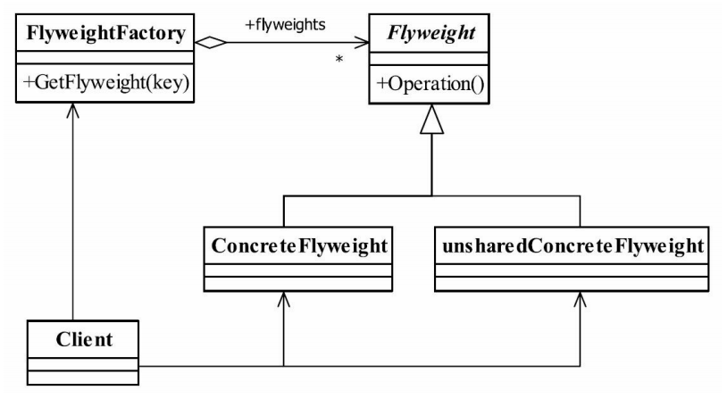

## 享元模式 Flyweight Pattern  池技术的重要实现方式
### 一.定义
Use sharing tosupport large numbers of fine-grained objects efficiently.
（使用共享对象可有效地支持大量的细粒度的对象。）
### 二.内部状态（intrinsic）与外部状态（extrinsic）。
#### 1.内部状态
内部状态是对象可共享出来的信息，存储在享元对象内部并且不会随环境改变而改变，
如我们例子中的id、postAddress等，它们可以作为一个对象的动态附加信息，不必直接储存
在具体某个对象中，属于可以共享的部分。
#### 2.外部状态
外部状态是对象得以依赖的一个标记，是随环境改变而改变的、不可以共享的状态，如
我们例子中的考试科目+考试地点复合字符串，它是一批对象的统一标识，是唯一的一个索
引值。
### 三.通用类图

### 四.角色
#### 1.Flyweight——抽象享元角色
它简单地说就是一个产品的抽象类，同时定义出对象的外部状态和内部状态的接口或实
现。
#### 2.ConcreteFlyweight——具体享元角色
具体的一个产品类，实现抽象角色定义的业务。该角色中需要注意的是内部状态处理应
该与环境无关，不应该出现一个操作改变了内部状态，同时修改了外部状态，这是绝对不允
许的。
#### 3.unsharedConcreteFlyweight——不可共享的享元角色
不存在外部状态或者安全要求（如线程安全）不能够使用共享技术的对象，该对象一般
不会出现在享元工厂中。
#### 4.FlyweightFactory——享元工厂
职责非常简单，就是构造一个池容器，同时提供从池中获得对象的方法。
### 五.享元模式的优点和缺点
享元模式是一个非常简单的模式，它可以大大减少应用程序创建的对象，降低程序内存
的占用，增强程序的性能，但它同时也提高了系统复杂性，需要分离出外部状态和内部状
态，而且外部状态具有固化特性，不应该随内部状态改变而改变，否则导致系统的逻辑混
乱。
