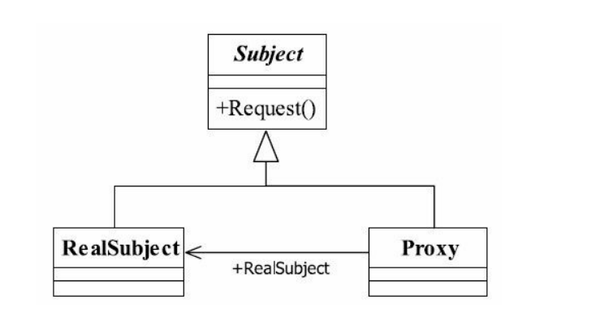
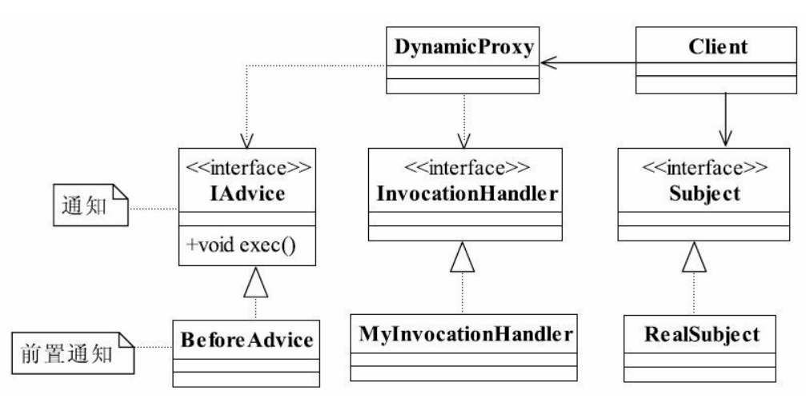
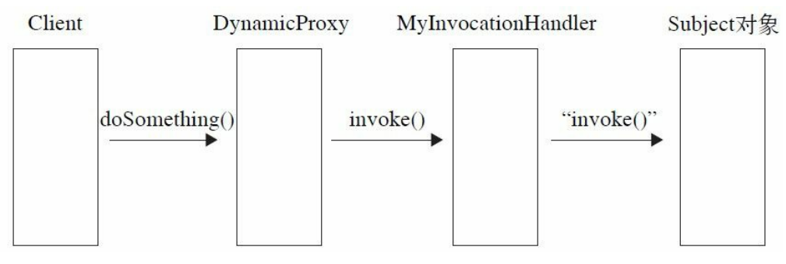

##代理模式  Proxy Pattern
###一.定义如下：
Provide a surrogate or placeholder for another object to control access to it.（为其他对象提供
一种代理以控制对这个对象的访问。）
###二.通用类图

###三.角色的定义：
####1.Subject抽象主题角色
抽象主题类可以是抽象类也可以是接口，是一个最普通的业务类型定义，无特殊要求。
####2.RealSubject具体主题角色
也叫做被委托角色、被代理角色。它才是冤大头，是业务逻辑的具体执行者。
####3.Proxy代理主题角色
也叫做委托类、代理类。它负责对真实角色的应用，把所有抽象主题类定义的方法限制
委托给真实主题角色实现，并且在真实主题角色处理完毕前后做预处理和善后处理工作。
###四.代理模式的优点
####1.职责清晰
真实的角色就是实现实际的业务逻辑，不用关心其他非本职责的事务，通过后期的代理
完成一件事务，附带的结果就是编程简洁清晰。
####2.高扩展性
具体主题角色是随时都会发生变化的，只要它实现了接口，甭管它如何变化，都逃不脱
如来佛的手掌（接口），那我们的代理类完全就可以在不做任何修改的情况下使用。
####3.智能化
这在我们以上的讲解中还没有体现出来，不过在我们以下的动态代理章节中你就会看到
代理的智能化有兴趣的读者也可以看看Struts是如何把表单元素映射到对象上的。
###五.代理模式的使用场景
我相信第一次接触到代理模式的读者肯定很郁闷，为什么要用代理呀？想想现实世界
吧，打官司为什么要找个律师？因为你不想参与中间过程的是是非非，只要完成自己的答辩
就成，其他的比如事前调查、事后追查都由律师来搞定，这就是为了减轻你的负担。代理模
式的使用场景非常多，大家可以看看Spring AOP，这是一个非常典型的动态代理。
###六.动态代理通用类图

###七.动态代理调用过程示意图
