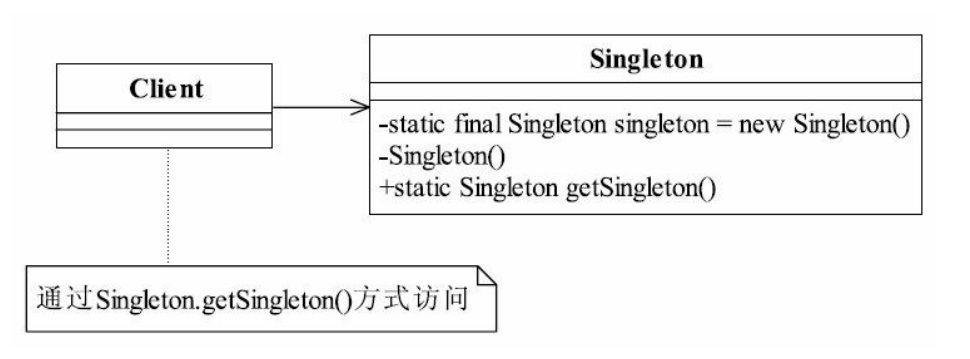
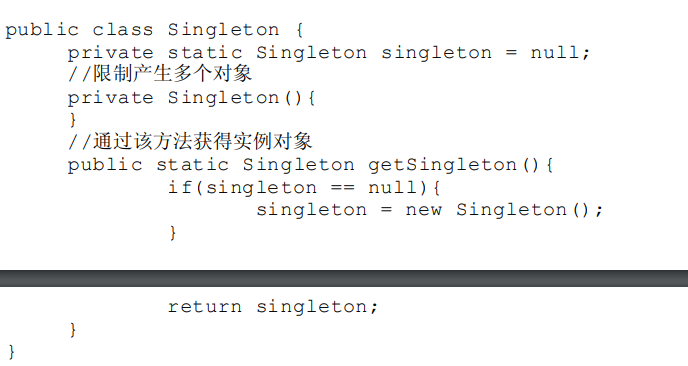

##单例模式（Singleton Pattern）是一个比较简单的模式，
###一.定义如下：
Ensure a class has only one instance, and provide a global point of access to it.（确保某一个类
只有一个实例，而且自行实例化并向整个系统提供这个实例。）

###二.通用类图

###三.单例模式的优点
#### 1.由于单例模式在内存中只有一个实例，减少了内存开支，特别是一个对象需要频繁地创建、销毁时，而且创建或销毁时性能又无法优化，单例模式的优势就非常明显。
#### 2.由于单例模式只生成一个实例，所以减少了系统的性能开销，当一个对象的产生需要比较多的资源时，如读取配置、产生其他依赖对象时，则可以通过在应用启动时直接产生一个单例对象，然后用永久驻留内存的方式来解决（在Java EE中采用单例模式时需要注意JVM垃圾回收机制）。
#### 3.单例模式可以避免对资源的多重占用，例如一个写文件动作，由于只有一个实例存在内存中，避免对同一个资源文件的同时写操作。
#### 4.单例模式可以在系统设置全局的访问点，优化和共享资源访问，例如可以设计一个单例类，负责所有数据表的映射处理。
###四.单例模式的缺点
#### 1.单例模式一般没有接口，扩展很困难，若要扩展，除了修改代码基本上没有第二种途径可以实现。单例模式为什么不能增加接口呢？因为接口对单例模式是没有任何意义的，它要求“自行实例化”，并且提供单一实例、接口或抽象类是不可能被实例化的。当然，在特殊情况下，单例模式可以实现接口、被继承等，需要在系统开发中根据环境判断。
#### 2.单例模式对测试是不利的。在并行开发环境中，如果单例模式没有完成，是不能进行测试的，没有接口也不能使用mock的方式虚拟一个对象。
#### 3.单例模式与单一职责原则有冲突。一个类应该只实现一个逻辑，而不关心它是否是单例的，是不是要单例取决于环境，单例模式把“要单例”和业务逻辑融合在一个类中。

###四.单例模式的使用场景
在一个系统中，要求一个类有且仅有一个对象，如果出现多个对象就会出现“不良反
应”，可以采用单例模式，具体的场景如下：
####1.要求生成唯一序列号的环境；
####2.在整个项目中需要一个共享访问点或共享数据，例如一个Web页面上的计数器，可以不用把每次刷新都记录到数据库中，使用单例模式保持计数器的值，并确保是线程安全的；
####3.创建一个对象需要消耗的资源过多，如要访问IO和数据库等资源；
####4.需要定义大量的静态常量和静态方法（如工具类）的环境，可以采用单例模式（当然，也可以直接声明为static的方式）。
###五.单例模式的注意事项
####1.在高并发情况下，请注意单例模式的线程同步问题。
单例模式有几种不同的实现
如下单例模式就需要考虑线程同步。

该单例模式在低并发的情况下尚不会出现问题，若系统压力增大，并发量增加时则可能
在内存中出现多个实例，破坏了最初的预期。为什么会出现这种情况呢？如一个线程A执行
到singleton = new Singleton()，但还没有获得对象（对象初始化是需要时间的），第二个线程
B也在执行，执行到（singleton == null）判断，那么线程B获得判断条件也是为真，于是继续
运行下去，线程A获得了一个对象，线程B也获得了一个对象，在内存中就出现两个对象！
解决线程不安全的方法很有多，可以在getSingleton方法前加synchronized关键字，也可以
在getSingleton方法内增加synchronized来实现，但都不是最优秀的单例模式，建议读者使用如
代码清单7-3所示的方式（有的书上把代码清单7-3中的单例称为饿汉式单例，在代码清单7-4
中增加了synchronized的单例称为懒汉式单例）。
####2.需要考虑对象的复制情况。
在Java中，对象默认是不可以被复制的，若实现了
Cloneable接口，并实现了clone方法，则可以直接通过对象复制方式创建一个新对象，对象
复制是不用调用类的构造函数，因此即使是私有的构造函数，对象仍然可以被复制。在一般
情况下，类复制的情况不需要考虑，很少会出现一个单例类会主动要求被复制的情况，解决
该问题的最好方法就是单例类不要实现Cloneable接口。