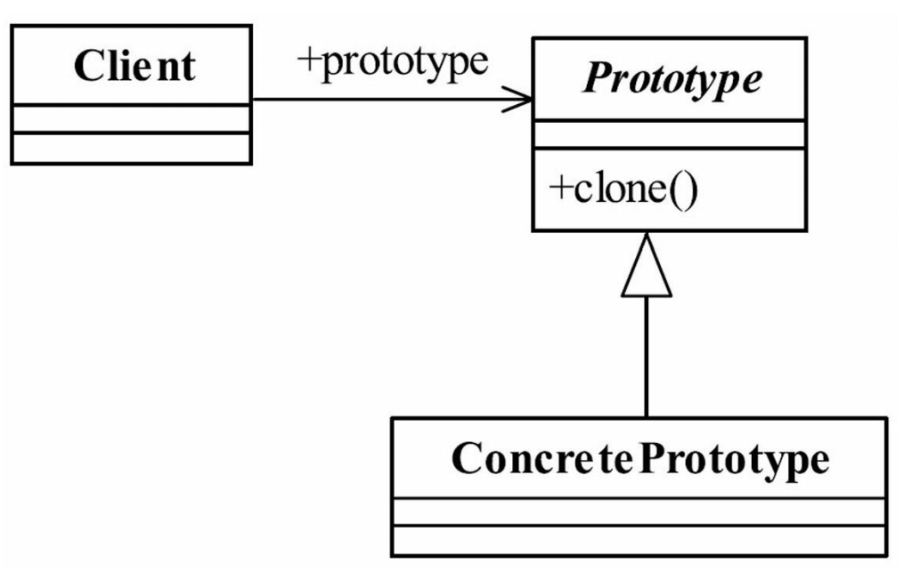

##原型模式（Prototype Pattern）
###一.定义如下：
Specify the kinds of objects to create using a prototypical instance,and create new objects by
copying this prototype.（用原型实例指定创建对象的种类，并且通过拷贝这些原型创建新的对
象。）
###二.通用类图

###三.原型模式的优点
####1.性能优良
原型模式是在内存二进制流的拷贝，要比直接new一个对象性能好很多，特别是要在一
个循环体内产生大量的对象时，原型模式可以更好地体现其优点。
####2.逃避构造函数的约束
这既是它的优点也是缺点，直接在内存中拷贝，构造函数是不会执行的（参见13.4
节）。优点就是减少了约束，缺点也是减少了约束，需要大家在实际应用时考虑。
###四.原型模式的使用场景
####1.资源优化场景
类初始化需要消化非常多的资源，这个资源包括数据、硬件资源等。
####2.性能和安全要求的场景
通过new产生一个对象需要非常繁琐的数据准备或访问权限，则可以使用原型模式。
####3.一个对象多个修改者的场景
一个对象需要提供给其他对象访问，而且各个调用者可能都需要修改其值时，可以考虑
使用原型模式拷贝多个对象供调用者使用。
在实际项目中，原型模式很少单独出现，一般是和工厂方法模式一起出现，通过clone的
方法创建一个对象，然后由工厂方法提供给调用者。原型模式已经与Java融为一体，大家可
以随手拿来使用。