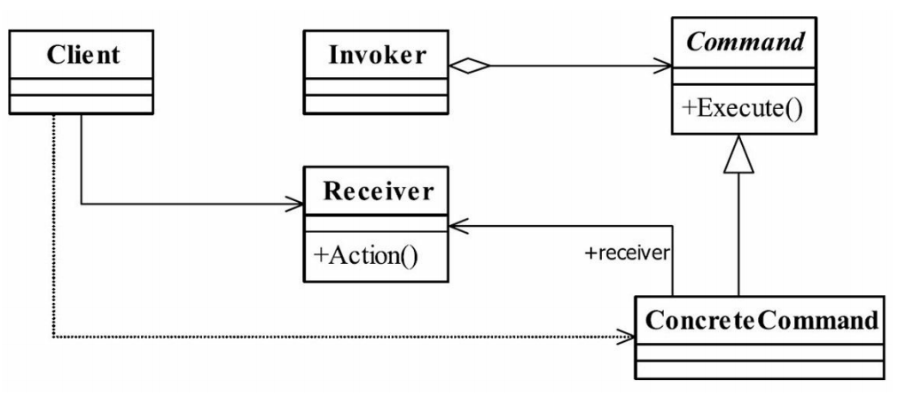

##命令模式
###一.定义
Encapsulate a request as an object,thereby
letting you parameterize clients with different requests,queue or log requests,and support undoable
operations.（将一个请求封装成一个对象，从而让你使用不同的请求把客户端参数化，对请
求排队或者记录请求日志，可以提供命令的撤销和恢复功能。）
###二.通用类图

###三.角色
####1.Receive接收者角色
该角色就是干活的角色，命令传递到这里是应该被执行的，具体到我们上面的例子中就
是Group的三个实现类。
####2.Command命令角色
需要执行的所有命令都在这里声明。
####3.Invoker调用者角色
接收到命令，并执行命令。在例子中，我（项目经理）就是这个角色。
###四.命令模式的优点
####1.类间解耦
调用者角色与接收者角色之间没有任何依赖关系，调用者实现功能时只需调用Command
抽象类的execute方法就可以，不需要了解到底是哪个接收者执行。
####2.可扩展性
Command的子类可以非常容易地扩展，而调用者Invoker和高层次的模块Client不产生严
重的代码耦合。
####3.命令模式结合其他模式会更优秀
命令模式可以结合责任链模式，实现命令族解析任务；结合模板方法模式，则可以减少
Command子类的膨胀问题。
###五.命令模式的缺点
命令模式也是有缺点的，请看Command的子类：如果有N个命令，问题就出来
了，Command的子类就可不是几个，而是N个，这个类膨胀得非常大，这个就需要在项
目中慎重考虑使用。
