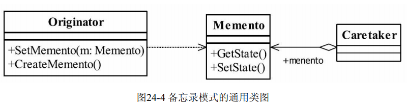
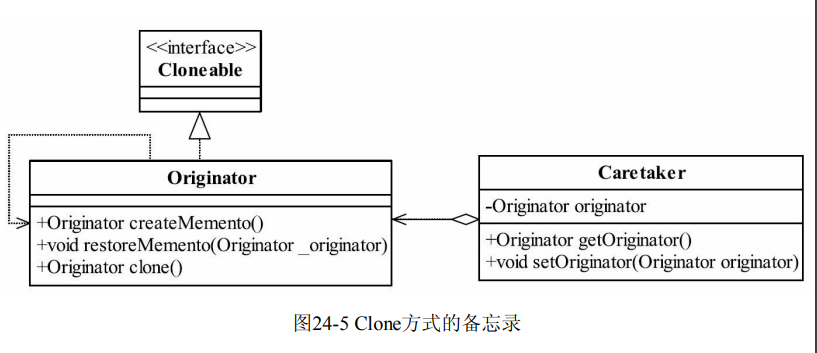
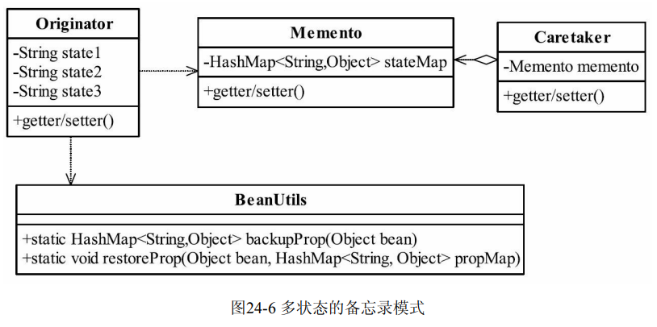
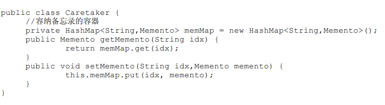
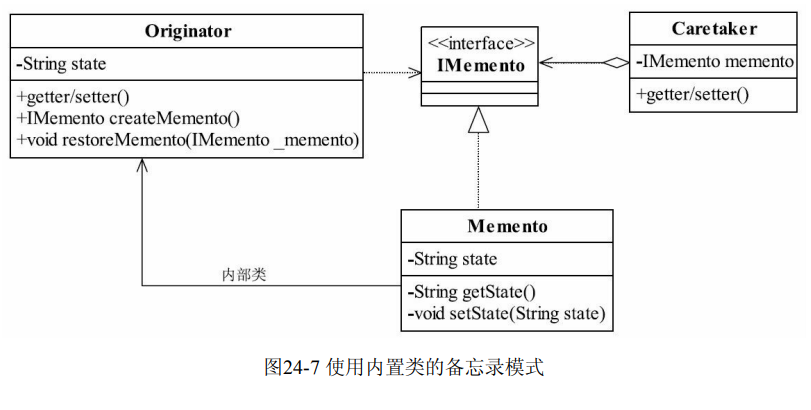

## 备忘录模式 Memento Pattern
### 一.定义
Without violating encapsulation,capture and externalize an object's internal state so that the
object can be restored to this state later.（在不破坏封装性的前提下，捕获一个对象的内部状
态，并在该对象之外保存这个状态。这样以后就可将该对象恢复到原先保存的状态。）
### 二.通用类图

### 三.角色
#### 1.Originator发起人角色
记录当前时刻的内部状态，负责定义哪些属于备份范围的状态，负责创建和恢复备忘录
数据。
#### 2.Memento备忘录角色
负责存储Originator发起人对象的内部状态，在需要的时候提供发起人需要的内部状态。
#### 3.Caretaker备忘录管理员角色
对备忘录进行管理、保存和提供备忘录。
### 四.备忘录模式的注意事项
####1.备忘录的生命期
备忘录创建出来就要在“最近”的代码中使用，要主动管理它的生命周期，建立就要使
用，不使用就要立刻删除其引用，等待垃圾回收器对它的回收处理。
####2.备忘录的性能
不要在频繁建立备份的场景中使用备忘录模式（比如一个for循环中），原因有二：一是
控制不了备忘录建立的对象数量；二是大对象的建立是要消耗资源的，系统的性能需要考
虑。因此，如果出现这样的代码，设计师就应该好好想想怎么修改架构
### 五.扩展
#### 1.clone方式的备忘录

#### 2.多状态的备忘录模式

#### 3.多备份的备忘录

#### 4.封装得更好一点

