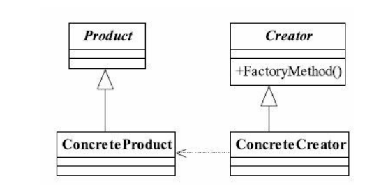

##工厂方法模式 Factory Method Pattern
###一.其定义为：
Define an interface for creating an object,but let subclasses decide which class to
instantiate.Factory Method lets a class defer instantiation to subclasses.（定义一个用于创建对象的
接口，让子类决定实例化哪一个类。工厂方法使一个类的实例化延迟到其子类。）

###二.通用类图
  

###三.工厂方法模式的优点
####1.良好的封装性，代码结构清晰。
一个对象创建是有条件约束的，如一个调用者需要一个具体的产品对象，只要知道这个产品
的类名（或约束字符串）就可以了，不用知道创建对象的艰辛过程，降低模块间的耦合。
####2.工厂方法模式的扩展性非常优秀。
在增加产品类的情况下，只要适当地修改具体的工厂类或扩展一个工厂类，就可以完成
“拥抱变化”。例如在我们的例子中，需要增加一个
棕色人种，则只需要增加一个BrownHuman类，工厂类不用任何修改就可完成系统扩展。
####3.屏蔽产品类。
这一特点非常重要，产品类的实现如何变化，调用者都不需要关
心，它只需要关心产品的接口，只要接口保持不变，系统中的上层模块就不要发生变化。因
为产品类的实例化工作是由工厂类负责的，一个产品对象具体由哪一个产品生成是由工厂类
决定的。在数据库开发中，大家应该能够深刻体会到工厂方法模式的好处：如果使用JDBC
连接数据库，数据库从MySQL切换到Oracle，需要改动的地方就是切换一下驱动名称（前提
条件是SQL语句是标准语句），其他的都不需要修改，这是工厂方法模式灵活性的一个直接
案例。
####4.工厂方法模式是典型的解耦框架。
高层模块值需要知道产品的抽象类，其他的实
现类都不用关心，符合迪米特法则，我不需要的就不要去交流；也符合依赖倒置原则，只依
赖产品类的抽象；当然也符合里氏替换原则，使用产品子类替换产品父类，没问题！
###四.工厂方法模式的使用场景
首先，工厂方法模式是new一个对象的替代品，所以在所有需要生成对象的地方都可以
使用，但是需要慎重地考虑是否要增加一个工厂类进行管理，增加代码的复杂度。
其次，需要灵活的、可扩展的框架时，可以考虑采用工厂方法模式。万物皆对象，那万
物也就皆产品类，例如需要设计一个连接邮件服务器的框架，有三种网络协议可供选择：
POP3、IMAP、HTTP，我们就可以把这三种连接方法作为产品类，定义一个接口如
IConnectMail，然后定义对邮件的操作方法，用不同的方法实现三个具体的产品类（也就是
连接方式）再定义一个工厂方法，按照不同的传入条件，选择不同的连接方式。如此设计，
可以做到完美的扩展，如某些邮件服务器提供了WebService接口，很好，我们只要增加一个
产品类就可以了。
再次，工厂方法模式可以用在异构项目中，例如通过WebService与一个非Java的项目交
互，虽然WebService号称是可以做到异构系统的同构化，但是在实际的开发中，还是会碰到
很多问题，如类型问题、WSDL文件的支持问题，等等。从WSDL中产生的对象都认为是一
个产品，然后由一个具体的工厂类进行管理，减少与外围系统的耦合。
最后，可以使用在测试驱动开发的框架下。例如，测试一个类A，就需要把与类A有关
联关系的类B也同时产生出来，我们可以使用工厂方法模式把类B虚拟出来，避免类A与类B
的耦合。目前由于JMock和EasyMock的诞生，该使用场景已经弱化了，读者可以在遇到此种
情况时直接考虑使用JMock或EasyMock。