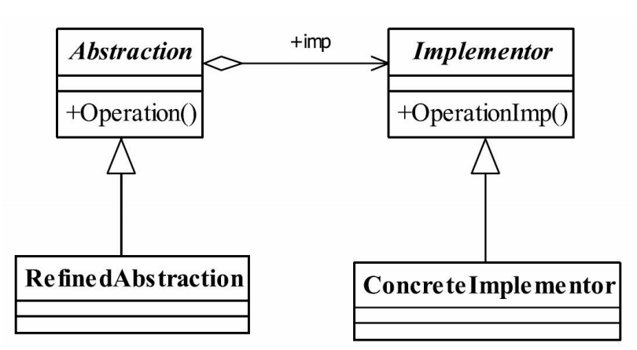

## 桥梁模式 Bridge Pattern
### 一.定义
Decouple an abstraction from its implementation so that the two can vary independently.
（将抽象和实现解耦，使得两者可以独立地变化。）
### 二.通用类图

### 三.角色
#### 1.Abstraction——抽象化角色
它的主要职责是定义出该角色的行为，同时保存一个对实现化角色的引用，该角色一般
是抽象类。
#### 2.Implementor——实现化角色
它是接口或者抽象类，定义角色必需的行为和属性。
#### 3.RefinedAbstraction——修正抽象化角色
它引用实现化角色对抽象化角色进行修正。
#### 4.ConcreteImplementor——具体实现化角色
它实现接口或抽象类定义的方法和属性。
### 四.桥梁模式的优点
#### 1.抽象和实现分离
这也是桥梁模式的主要特点，它完全是为了解决继承的缺点而提出的设计模式。在该模
式下，实现可以不受抽象的约束，不用再绑定在一个固定的抽象层次上。
#### 2.优秀的扩充能力
看看我们的例子，想增加实现？没问题！想增加抽象，也没有问题！只要对外暴露的接
口层允许这样的变化，我们已经把变化的可能性减到最小。
#### 3.实现细节对客户透明
客户不用关心细节的实现，它已经由抽象层通过聚合关系完成了封装。
### 五.