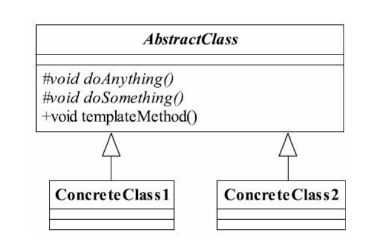

##模板方法模式（Template Method Pattern）
###一.其定义如下：
Define the skeleton of an algorithm in an operation,deferring some steps to subclasses.Template
Method lets subclasses redefine certain steps of an algorithm without changing the algorithm's
structure.（定义一个操作中的算法的框架，而将一些步骤延迟到子类中。使得子类可以不改
变一个算法的结构即可重定义该算法的某些特定步骤。）

###二.通用类图

###三.模板方法模式的优点
####1.封装不变部分，扩展可变部分
把认为是不变部分的算法封装到父类实现，而可变部分的则可以通过继承来继续扩展。
在悍马模型例子中，是不是就非常容易扩展？例如增加一个H3型号的悍马模型，很容易
呀，增加一个子类，实现父类的基本方法就可以了。
####2.提取公共部分代码，便于维护
我们例子中刚刚走过的弯路就是最好的证明，如果我们不抽取到父类中，任由这种散乱
的代码发生，想想后果是什么样子？维护人员为了修正一个缺陷，需要到处查找类似的代
码！
####3.行为由父类控制，子类实现
基本方法是由子类实现的，因此子类可以通过扩展的方式增加相应的功能，符合开闭原
则。
###四.模板方法模式的缺点
按照我们的设计习惯，抽象类负责声明最抽象、最一般的事物属性和方法，实现类完成
具体的事物属性和方法。但是模板方法模式却颠倒了，抽象类定义了部分抽象方法，由子类
实现，子类执行的结果影响了父类的结果，也就是子类对父类产生了影响，这在复杂的项目
中，会带来代码阅读的难度，而且也会让新手产生不适感。
###五.模板方法模式的使用场景
####1.多个子类有公有的方法，并且逻辑基本相同时。
####2.重要、复杂的算法，可以把核心算法设计为模板方法，周边的相关细节功能则由各个子类实现。
####3.重构时，模板方法模式是一个经常使用的模式，把相同的代码抽取到父类中，然后通过钩子函数（见“模板方法模式的扩展”）约束其行为。