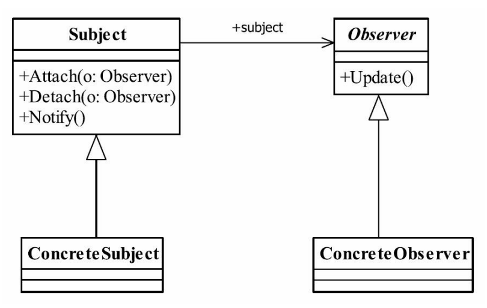

##观察者模式  Observer Pattern
### 一.定义
Define a one-to-many dependency between objects so that when one object changes state,all its
dependents are notified and updated automatically.（定义对象间一种一对多的依赖关系，使得每
当一个对象改变状态，则所有依赖于它的对象都会得到通知并被自动更新。）
### 二. 通用类图

### 三.角色
#### 1.Subject被观察者
定义被观察者必须实现的职责，它必须能够动态地增加、取消观察者。它一般是抽象类
或者是实现类，仅仅完成作为被观察者必须实现的职责：管理观察者并通知观察者。
#### 2.Observer观察者
观察者接收到消息后，即进行update（更新方法）操作，对接收到的信息进行处理。
#### 3.ConcreteSubject具体的被观察者
定义被观察者自己的业务逻辑，同时定义对哪些事件进行通知。
#### 4.ConcreteObserver具体的观察者
每个观察在接收到消息后的处理反应是不同，各个观察者有自己的处理逻辑。
### 四.观察者模式的优点
#### 1.观察者和被观察者之间是抽象耦合
如此设计，则不管是增加观察者还是被观察者都非常容易扩展，而且在Java中都已经实
现的抽象层级的定义，在系统扩展方面更是得心应手。
#### 2.建立一套触发机制
根据单一职责原则，每个类的职责是单一的，那么怎么把各个单一的职责串联成真实世
界的复杂的逻辑关系呢？比如，我们去打猎，打死了一只母鹿，母鹿有三个幼崽，因失去了
母鹿而饿死，尸体又被两只秃鹰争抢，因分配不均，秃鹰开始斗殴，然后羸弱的秃鹰死掉，
生存下来的秃鹰，则因此扩大了地盘……这就是一个触发机制，形成了一个触发链。观察者
模式可以完美地实现这里的链条形式。
### 五.观察者模式的缺点
观察者模式需要考虑一下开发效率和运行效率问题，一个被观察者，多个观察者，开发
和调试就会比较复杂，而且在Java中消息的通知默认是顺序执行，一个观察者卡壳，会影响
整体的执行效率。在这种情况下，一般考虑采用异步的方式。
