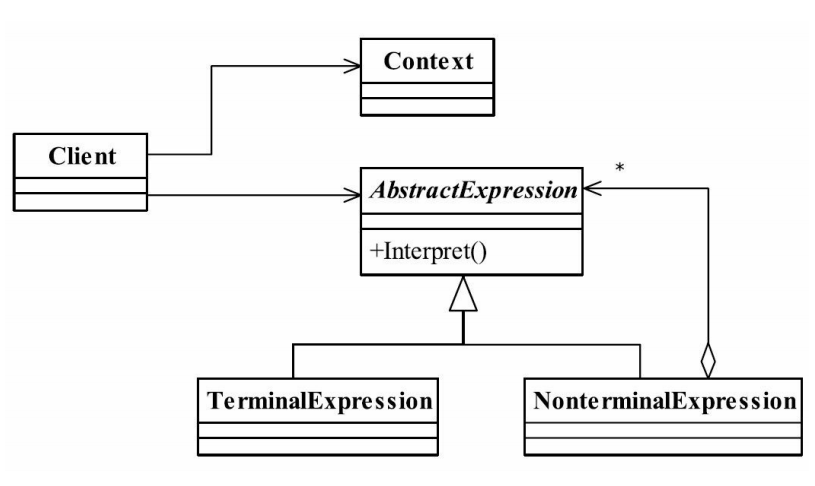

## 解释器模式  Interpreter Pattern
### 一.定义
Given a language, define a representation for its grammar along with an
interpreter that uses the representation to interpret sentences in the language.（给定一门语言，定义
它的文法的一种表示，并定义一个解释器，该解释器使用该表示来解释语言中的句子。）
### 二.通用类图

### 三.角色
#### 1.AbstractExpression——抽象解释器
具体的解释任务由各个实现类完成，具体的解释器分别由TerminalExpression和NonterminalExpression完成。
#### 2.TerminalExpression——终结符表达式
实现与文法中的元素相关联的解释操作，通常一个解释器模式中只有一个终结符表达
式，但有多个实例，对应不同的终结符。具体到我们例子就是VarExpression类，表达式中的
每个终结符都在栈中产生了一个VarExpression对象。
#### 3.NonterminalExpression——非终结符表达式
文法中的每条规则对应于一个非终结表达式，具体到我们的例子就是加减法规则分别对
应到AddExpression和SubExpression两个类。非终结符表达式根据逻辑的复杂程度而增加，原
则上每个文法规则都对应一个非终结符表达式。
#### 4.Context——环境角色
具体到我们的例子中是采用HashMap代替。
### 四.解释器模式的优点
解释器是一个简单语法分析工具，它最显著的优点就是扩展性，修改语法规则只要修改
相应的非终结符表达式就可以了，若扩展语法，则只要增加非终结符类就可以了。
### 五.解释器模式的缺点
#### 1.解释器模式会引起类膨胀
每个语法都要产生一个非终结符表达式，语法规则比较复杂时，就可能产生大量的类文
件，为维护带来了非常多的麻烦。
#### 2.解释器模式采用递归调用方法
每个非终结符表达式只关心与自己有关的表达式，每个表达式需要知道最终的结果，必
须一层一层地剥茧，无论是面向过程的语言还是面向对象的语言，递归都是在必要条件下使
用的，它导致调试非常复杂。想想看，如果要排查一个语法错误，我们是不是要一个断点一
个断点地调试下去，直到最小的语法单元。
#### 3.效率问题
解释器模式由于使用了大量的循环和递归，效率是一个不容忽视的问题，特别是一用于
解析复杂、冗长的语法时，效率是难以忍受的。

