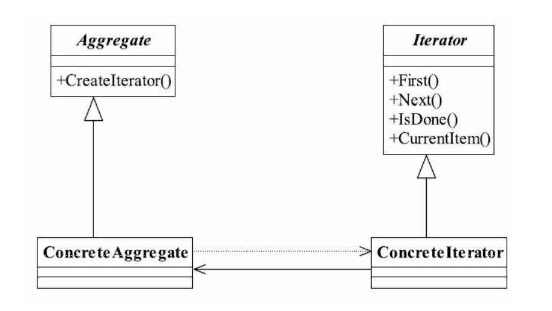

##迭代器模式 Iterator Pattern
###一.定义
Provide a way to access the elements of an aggregate object sequentially without exposing its
underlying representation.（它提供一种方法访问一个容器对象中各个元素，而又不需暴露该
对象的内部细节。）
###二.通用类图

###三.角色
####1.Iterator抽象迭代器
抽象迭代器负责定义访问和遍历元素的接口，而且基本上是有固定的3个方法：first()获
得第一个元素，next()访问下一个元素，isDone()是否已经访问到底部（Java叫做hasNext()方法）。
####2.ConcreteIterator具体迭代器
具体迭代器角色要实现迭代器接口，完成容器元素的遍历。
####3.Aggregate抽象容器
容器角色负责提供创建具体迭代器角色的接口，必然提供一个类似createIterator()这样的
方法，在Java中一般是iterator()方法。
####4.Concrete Aggregate具体容器
具体容器实现容器接口定义的方法，创建出容纳迭代器的对象。

