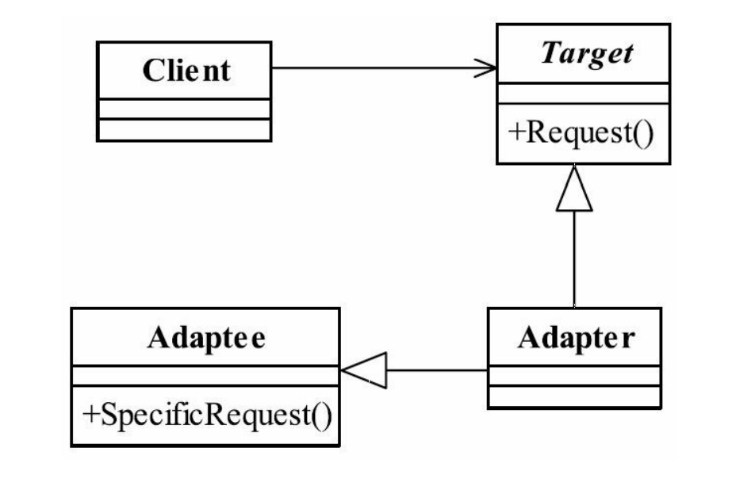
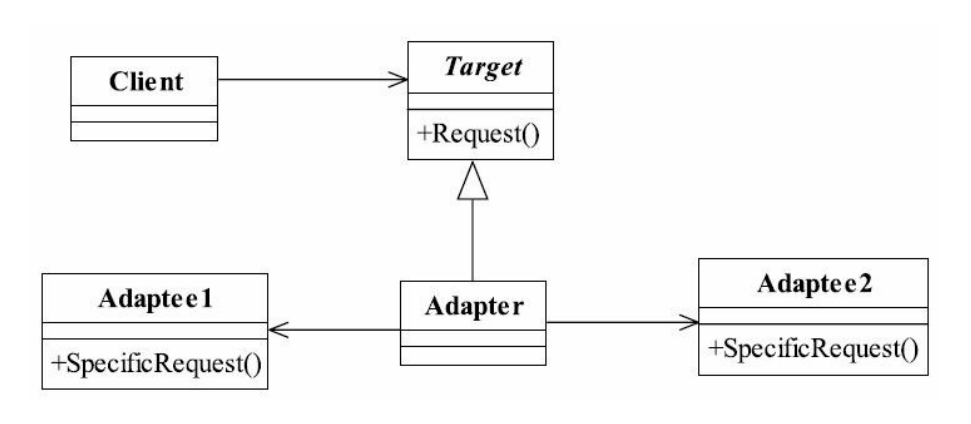

##适配器模式 Adapter Pattern
###一.定义
Convert the interface of a class into another interface clients expect.Adapter lets classes work
together that couldn't otherwise because of incompatible interfaces.（将一个类的接口变换成客户
端所期待的另一种接口，从而使原本因接口不匹配而无法在一起工作的两个类能够在一起工
作。）
###二.类适配器通用类图

###三.角色
####1.Target目标角色
该角色定义把其他类转换为何种接口，也就是我们的期望接口，例子中的IUserInfo接口
####2.Adaptee源角色
你想把谁转换成目标角色，这个“谁”就是源角色，它是已经存在的、运行良好的类或对
象，经过适配器角色的包装，它会成为一个崭新、靓丽的角色。
####3.Adapter适配器角色
适配器模式的核心角色，其他两个角色都是已经存在的角色，而适配器角色是需要新建
立的，它的职责非常简单：把源角色转换为目标角色，怎么转换？通过继承或是类关联的方
式。
###三.适配器模式的优点
####1.适配器模式可以让两个没有任何关系的类在一起运行，只要适配器这个角色能够搞定他们就成。
####2.增加了类的透明性
想想看，我们访问的Target目标角色，但是具体的实现都委托给了源角色，而这些对高
层次模块是透明的，也是它不需要关心的。
####3.提高了类的复用度
当然了，源角色在原有的系统中还是可以正常使用，而在目标角色中也可以充当新的演
员。
####4.灵活性非常好
某一天，突然不想要适配器，没问题，删除掉这个适配器就可以了，其他的代码都不用
修改，基本上就类似一个灵活的构件，想用就用，不想就卸载。
###四.对象适配器通用类图

