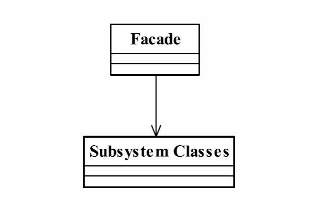

## 门面模式 Facade Pattern
### 一.定义
Provide a unified interface to a set of interfaces in a subsystem.Facade defines a higher-level
interface that makes the subsystem easier to use.（要求一个子系统的外部与其内部的通信必须通
过一个统一的对象进行。门面模式提供一个高层次的接口，使得子系统更易于使用。）
### 二.通用类图

### 三.角色
#### 1.Facade门面角色
客户端可以调用这个角色的方法。此角色知晓子系统的所有功能和责任。一般情况下，
本角色会将所有从客户端发来的请求委派到相应的子系统去，也就说该角色没有实际的业务
逻辑，只是一个委托类。
#### 2.subsystem子系统角色
可以同时有一个或者多个子系统。每一个子系统都不是一个单独的类，而是一个类的集
合。子系统并不知道门面的存在。对于子系统而言，门面仅仅是另外一个客户端而已。
### 四.门面模式的优点
####1.减少系统的相互依赖
想想看，如果我们不使用门面模式，外界访问直接深入到子系统内部，相互之间是一种
强耦合关系，你死我就死，你活我才能活，这样的强依赖是系统设计所不能接受的，门面模
式的出现就很好地解决了该问题，所有的依赖都是对门面对象的依赖，与子系统无关。
#### 2.提高了灵活性
依赖减少了，灵活性自然提高了。不管子系统内部如何变化，只要不影响到门面对象，
任你自由活动。
#### 3.提高安全性
想让你访问子系统的哪些业务就开通哪些逻辑，不在门面上开通的方法，你休想访问
到。
### 五.门面模式的缺点
门面模式最大的缺点就是不符合开闭原则，对修改关闭，对扩展开放，看看我们那个门
面对象吧，它可是重中之重，一旦在系统投产后发现有一个小错误，你怎么解决？完全遵从
开闭原则，根本没办法解决。继承？覆写？都顶不上用，唯一能做的一件事就是修改门面角
色的代码，这个风险相当大，这就需要大家在设计的时候慎之又慎，多思考几遍才会有好收
获。
